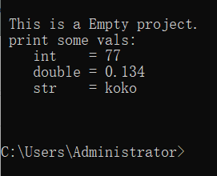
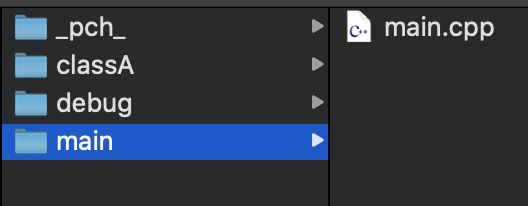
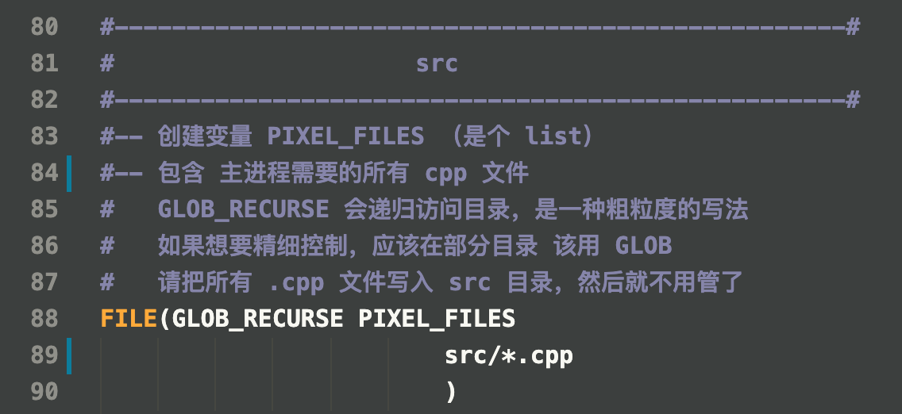

# Cpp_Empty_Project
**Cpp_Empty_Project** 是一个 跨平台的，基于cmake工具的，C++17空项目。

这是一个面相 C++ 新手向的，辅助用项目。

你可以以此项目为基础，搭建出自己的 跨平台 C++ 程序。但由于，cmake 在 win10 平台的使用有点小麻烦（下文提及）。所以这个项目也许更适合那些 Mac/Linux 用户。如果大家有更好的实现跨平台的方式，欢迎交流～

## 我该下载哪个分支
直接下载 Branch:**master** 即可。

## 此项目支持哪些平台
- **Win10**
- **MacOSX** (10.12 或更高版本) 
- **Ubuntu** (16.04 或更高版本) 

也许还能支持各个平台的较早版本，但我尚未测试。

## 支持哪款编译器
**Clang** 是最推荐的编译器，即便是在 **Win10** 平台。
请确保你所下载和安装的 **Clang** 版本，支持 **C++17**。

## 如何安装

### Mac OS X

在 **Mac** 平台的安装非常简单。

首先，确保你已经成功安装如下程序：
- **CMake** (3.1 或更高版本; 若想使用PCH，Unity-builds 技术加速编译，推荐 3.16 或更高版本)
- **Clang** (足以支持 **C++17** 的较新版本)

然后，打开 **终端**（terminal），**"cd"** 至 本项目的根目录： 

    $ cd .../appRootDir/

(**注意**，此处的 "appRootDir" 应替换为实际的根目录名字) 

接着，运行一份 shell 脚本程序：

    $ ./unix_release.sh

脚本 `unix_release.sh` 将会自动化地帮我们完成程序的 **build** 和本地化部署工作。
你也可以选择运行另一份脚本：`unix_debug.sh`， 正如名字所示，它将生成一份 **DEBUG** 版的程序。

现在，所有的安装工作都已经 **完成**!!!

你可以在目录： **.../appRootDir/build/publish/** 中找到可执行文件：**emptyApp**。
双击它，运行我们的程序!!!
(**注意**，此处的 "appRootDir" 应替换为实际的根目录名字)

### Ubuntu 
在 **Ubuntu** 上的安装与 **Mac OS X** 十分相似。

首先，请确保你已经安装如下程序：

**CMake** (3.1 或更高版本; 若想使用PCH，Unity-builds 技术加速编译，推荐 3.16 或更高版本)：

    $ sudo apt-get install cmake

**Clang** (足以支持 **C++17** 的较新版本)：

    $ sudo apt-get install llvm
    $ sudo apt-get install clang 

重设系统默认的 **C/C++编译器**：

    $ sudo update-alternatives --config c++
    $ sudo update-alternatives --config cc

现在，打开 **终端**（terminal），**"cd"** 至 本项目的根目录： 

    $ cd .../appRootDir/

(**注意**，此处的 "appRootDir" 应替换为实际的根目录名字)

接着，运行一份 shell 脚本程序：

    $ ./unix_release.sh

脚本 `unix_release.sh` 将会自动化地帮我们完成程序的 **build** 和本地化部署工作。
你也可以选择运行另一份脚本：`unix_debug.sh`， 正如名字所示，它将生存一份 **DEBUG** 版的程序。

现在，所有的安装工作都已经 **完成**!!!

你可以在目录： **.../appRootDir/build/publish/** 中找到可执行文件：**emptyApp**。
(**注意**，此处的 "appRootDir" 应替换为实际的根目录名字)

在 **终端** 中启动它：

    $ build/publish/emptyApp

运行我们的程序!!!

### Win10

为了支持 **Win10** 中的 **Clang**，我们首先要安装 **Visual Studio 2019**。

然后，启动 **Visual Studio 2019**，点选初始界面中的 `Open a local folder` 按钮，在弹出的窗口中，选择本程序的根目录 ->

进入主界面后，选择 **Manage Configurations...** 按钮 ->

在随之而来的 **CMake Settings** 面板中，移除掉已经存在的 **DEBUG** 配置，然后手动选择一份新的配置：**x64-Clang-Release** ->

如果 **CMake Settings** 面板中没有 **x64-Clang-Release** 选项，请检查Visual Studio中是否安装了如下组件:

找到 **Build root** 一览，将其值修改为: `${projectDir}\build`（**注意**，这一步非常重要，请务必不要遗漏）

在左侧的 **Solution Explorer** 面板中，右键单击文件：`CMakeLists.txt`，在弹出的下拉菜单中选择：`Generate Cache for cppEmptyProject` ->

这将帮助我们生成 cmake Cache 数据。
等待片刻，直到下方 **Output** 面板中出现 `CMake generation finished.` 信息。
这表示 cmake Cache 生成成功。

紧接着。在 **Visual Studio 2019** 左上方的 `Build` 菜单中，找到 `Build All` 按钮，点击它，开始正式的 **Build** 工作。（也可以使用快捷键:`F7`） ->

**Build** 工作 将会持续数分钟，直到我们在下方的 **Output** 面板中看到 `Build All succeeded.` 的信息。这表示，**Build** 成功。我们在 **Visual Studio 2019**
中的工作就全部结束了。

最后的最后，回到本项目所在的根目录。寻找并双击一份名为 `win.bat` 的脚本文件。
它将帮助我们执行本地化部署工作。
比如将一些 根目录下的 资源性目录（如 “shaders”,"jsons" 复制到 <root>/build/publish/ 目录下）
这个过程可能非常快，一闪而过。别担心，它已经运行了。如果你不放心，可以再次双击一遍。

现在，安装正式**完成**!!!

你可以在目录 **.../appRootDir/build/publish/** 中，找到可执行文件 **emptyApp.exe**，
它就是我们的程序本体。
(**注意**，此处的 "appRootDir" 应替换为实际的根目录名字)

由于本程序的 main() 函数中只有一些 命令行打印函数。如果直接双击运行此 .exe 程序，它可能只会闪出一个命令框，然后立马结束。
为了有效测试程序，你其实可以将这个 .exe 文件，拖进一个 命令行窗口中，然后按回车键来启动程序。如果一切正常，命令行窗口会打印如下信息：

# 使用方式
接下来，我们将介绍，如何使用这个空项目，来制作自己的 C++ 项目。

## 如何添加 C++ 代码文件（.h/.cpp/.hpp）

### .c/.cpp 文件

请将所有 C++ 代码文件，放入 `.../appRootDir/src/` 目录（及其递归子目录）下。这个目录的默认设置如下：

- 目录：`main` 放置程序的主文件 `main.cpp`
- 目录：`_pch_` 放置一个加速编译效率的文件 `pch.h`(下文会提及)
- 目录：`debug` 放置一个推荐的 终端打印函数 **debug::log()**, 用来代替 `std::iostream`
- 目录：`classA` 放置一组示范用 class 代码

原则上，你可以在目录 `src` 下创建任意 子目录（递归）或文件。在目前的 cmake 设置中，所以位于目录 `src` （及其递归子目录）下的 **.c/.cpp**， 都会被自动查找到并编译，正如 文件 `CMakeLists.txt` 中所写：

### .h/.hpp 文件

与 `.c/.cpp` 文件一致, `.h/.hpp` 文件也请全部放到 `src/` 目录（及其递归子目录）中。一种推荐的做法是，将同一个模块的代码文件: `.h/.hpp/.c/.cpp` 放在同一个目录下。

我们在 `CMakeLists.txt` 下编写了一个宏函数 `collect_head_dirs`, 它将自动遍历 `src/` 及其所有递归子目录。如果某个目录内含 `.h/.hpp` 文件，这个目录就会被收集到一个 `list` 中。最后,这个 `list` 会被自动添加进 **include路径列表**。

所以，当你在 `src/` 及其递归子目录 下的任何位置添加 `.h/.hpp` 文件时，你不需要对 cmake 配置文件做任何修改。cmake 会自动帮你处理好一切。

比方说，当你在目录 `.../src/a/b/c/` 下，新建一个文件 `koko.h` 时。 那么你就能在 `src/` 目录下的任一代码文件内，inlcude 到它：
    
    #include "koko.h"

而不是需要繁琐地写为：

    #include "a/b/c/koko.h"

当然，这种实现存在一个代价，就是要求你在 `src/` 目录下创建的所有 `.h/.hpp` 文件，都不能重名。

最后，如果你不喜欢这种实现，你可以在 `CMakeLists.txt` 中放弃这个 宏函数 的使用，通过手动添加 include 路径的方式，来精细化地管理 **include路径列表**。具体方法请搜索 cmake: `target_include_directories` 的使用。

## 项目构建规则
我们使用 cmake 工具自动编译和构建项目。最终，项目的可执行目录，就是 `.../appRootDir/build/publish/`。
在编译构建完毕后，你可以将这个 `publish` 目录，复制到电脑中的任意位置，都不会影响程序的运行。

目录 `publish` 下的 `emptyApp/emptyApp.exe` 文件，就是程序的可执行文件。

程序所依赖的一切附加数据，比如 shaders，jsons，pngs，都将在构建过程中，被复制到 `publish` 目录下。在 Mac/Linux 中，这个复制操作是由 脚本程序 `unix_release.sh, unix_debug.sh` 实现的。在 win10 中，这个复制操作是由 `win.bat` 实现的。整个操作也很简单，就是将 根目录下的 一些文件夹（及其体内的所有文件）复制进 `publish` 目录下。（在目前的示例中，我已经在根目录放入两个空目录：`jsons/, shaders/`, 以此来示范整个复制效果。当你成功编译构建项目后，你会在 `publish/` 目录下，看到这两个 空目录 ）

（如果你不愿意修改这些烦人的 脚本程序，你甚至可以手动复制，没有任何问题...）

## pch.h 到底是什么
我们注意到，我在 `src` 目录下放置了个 `_pch_/pch.h` 文件。并且，它还被写进了 `CMakeLists.txt` 中：
    
    target_precompile_headers( emptyApp PRIVATE ${CMAKE_CURRENT_SOURCE_DIR}/src/_pch_/pch.h )

这其实是借用了一个 cmake 3.16 以来支持的新功能：**Precompiled headers (PCH) 预编译头文件**。通俗地讲，如果有一组 `.h`文件，使用频率特别高，比如标准库的那些头文件，那你可以把这些头文件写入这个 `pch.h` 文件中。然后，当 cmake 开启相应功能后，将会在编译阶段，预先将这组 **头文件** 编译成一个 **中间件**，然后把这个 **中间件**, 自动添加进你的每一个 `.cpp` 文件中（是的，你什么都不用做）最终的目的就是 加快编译速度。

当然，如果你安装的 cmake 尚未达到 3.16, 这个功能并不会被触发。所以，保险起见，你也可以手动将 `#include "pch.h"` 这句话写到每个 .cpp 文件头部。

**pch** 文件的使用还有其它注意事项，推荐阅读 [**这篇文章**](https://onqtam.com/programming/2019-12-20-pch-unity-cmake-3-16/)

当然，你也有权彻底不用这个功能...

## Unity Build
在上面推荐的文章中，还介绍了 cmake 3.16 以来的另一个新功能：**Unity Build**。简单说，它也是用来加快编译速度的。
我已经将这部分代码写入 `CMakeLists.txt` 文件中，你将自动获得这个加速功能。

当然，如果你安装的 cmake 尚未达到 3.16, 这个功能也是不会被触发的...

## debug::log();
在 main()函数中，我们发现一个奇怪的 打印函数：`debug::log();` 这是我在整个空项目中，唯一夹带的私货～ 这个函数被定义在 `.../src/debug/` 目录下。通过使用一组类似 **python** 语法的 **格式化参数** 来将信息打印到 命令行终端（console）。这组参数的规则与 第三方库 **fmt** 一致。感兴趣的可以学习 **fmt** 的使用：[fmt](https://fmt.dev/latest/index.html) 

当然，您依旧有权不使用它，甚至彻底删除 `debug` 目录。

## 已经安装的 第三方库
所有的第三方库，推荐安装在 `.../appRootDir/deps/` 目录下。我已帮你安装了3个常用的库：
- **fmt**: 用来便捷地拼接字符串
- **glm**: 用来支持数学运算
- **RapidJSON**: 用来解析 json 文件

在 C++ 中，每一个第三方库，都有其独特的安装方式（包括如何写入 `CMakeLists.txt` 文件）在此暂不展开....

## 如何在代码层实现跨平台

最简单的跨平台方式就是：
    让代码检查一组宏，从而得知，自己当前正运行在哪个平台。然后根据这层判断，跳入不同的分支，执行对应的代码。

那么这组宏是从哪里来的呢？一个方式是，在项目编译阶段，由 cmake 工具写入某个 .h文件：

在根目录中，我们会找到一个名为 `sysconfig/` 的目录。它的体内包含一个名为 `SysConfig.h.in` 的文件。这个文件就是提供给 cmake，用来生成平台相关信息 用的。在编译阶段中，cmake 会根据当前平台信息，在目录 `.../publish/sysconfig/` 中，自动创建一个文件 `SysConfig.h`，并且：

- 如果当前处于 Mac 系统，这个.h文件中 会生成宏：TPR_OS_MACOSX_
- 如果当前处于 Linux 系统，这个.h文件中 会生成宏：TPR_OS_LINUX_
- 如果当前处于 win  系统，这个.h文件中 会生成宏：TPR_OS_WIN32_

通过这个机制，你可以在自己的程序代码中，先 `#include "SysConfig.h"`，然后检查是否存在某个宏，来确定自己所处的 操作系统类型。对于那些跨平台的，且依赖平台API 的代码来说，这会是个有用的功能。

## 更多描述有待未来写入
...

## 版权协议遵守 [MIT License](LICENSE)

## 欢迎反馈与建议
本程序的初衷是为了帮助大家，更便捷地搭建 C++项目。由于我也是爱好者，水平有限，这个项目还存在一些不足。比方说，这个项目似乎更适合 Mac/Linux 平台的开发者，对于 Win 开发者来说，它的调试和编译过程都有点繁琐。
此外，它的 cmake 文件写得也很业余。这方面欢迎高玩改进。

如果您有任何反馈或建议，都可以通过下方联系方式联系开发者本人。
*   E-mail: [turesnake@gmail.com](mailto:turesnake@gmail.com)
*   E-mail: [turesnake@icloud.com](mailto:turesnake@icloud.com)
*   QQ: 651700603
*   WeChat：turesnake

